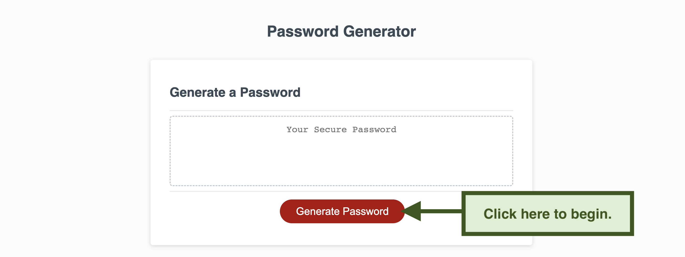
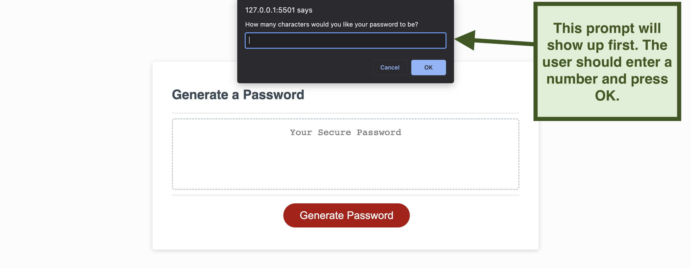
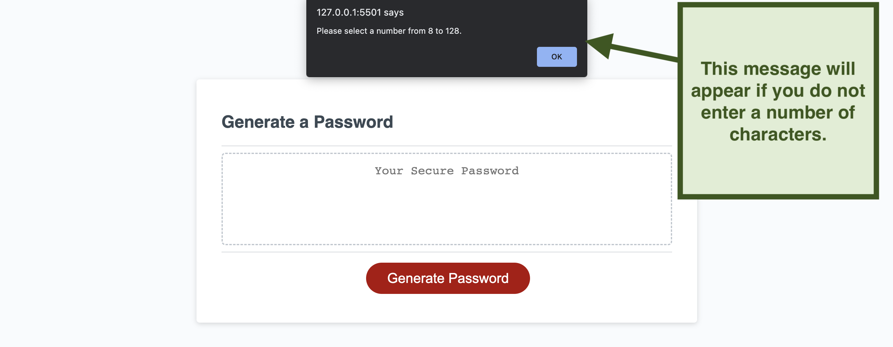
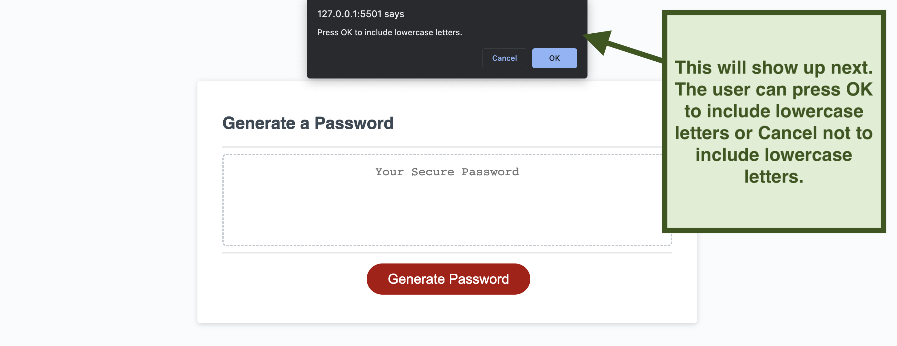
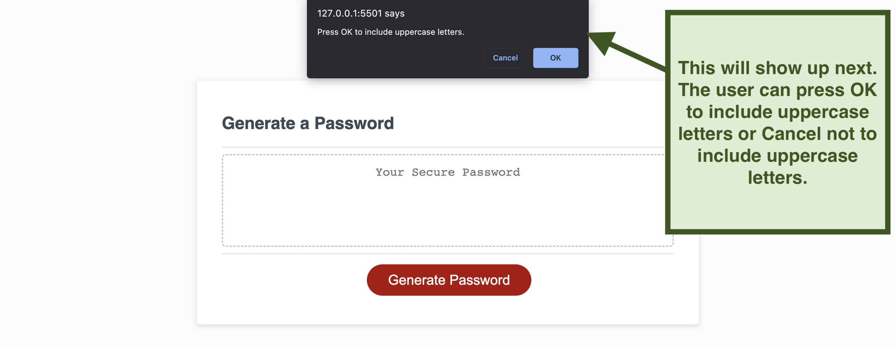
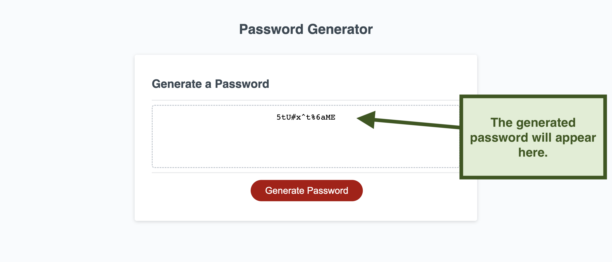

# Password Generator

<a href="https://l-jones-hub.github.io/Password-Generator/" title="" target="_blank">Deployed Site</a>

## Description

This project's purpose is to randomly generate a password based on criteria entered by the user.

## Usage

## Credits

The starter code for this project was provided by the University of Texas bootcamp instructor.
